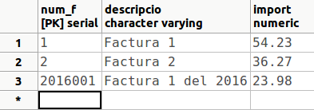

# 2. Consultes d'actualització (DML)

## 2.1 INSERT

Servirà per a introduir noves files en una determinada taula. Hi ha dues
variants d'aquesta sentència. La primera servirà per a introduir noves files
proporcionant-li les dades, és a dir, indicant expressament els nous valors
dels camps. L'altra podria servir per a introduir noves files de forma més
massiva, agafant les dades de les taules ja existents per mig d'una sentència
SELECT.

**<u>Sintaxi</u>** 

per a inserció amb valors

      INSERT INTO taula [ (camp1 [,camp2 [,...]]) ]  
        VALUES (valor1 [,valor2 [,...]]) [,(...)]

Com es pot comprovar d'aquesta manera s'introduirà una fila nova, i es
proporcionen les dades directament, com a constants. Opcionalment podem
introduir els valors per a una segona fila o quantes es vulguen, sempre posant
les dades de cada fila entre parèntesis, i si hi ha més d'una fila, separats
per comes.

És opcional posar la llista de camps de la taula. Si no es posen, s'haurà de
posar un valor per a cada camp de la taula, i en el mateix ordre com estan
definits en la taula.

Si posem expressament els camps de la taula, els podrem posar amb l'ordre que
vulguem, i no caldrà posar-los tots. Els camps no especificats quedaran amb el
valor nul (a no ser que tinguen un valor predeterminat, un valor per defecte).
Per tant, haurem de posar obligatòriament tots els camps definits com a no
nuls (inclosa la clau principal).

Per a posar el valor nul a un camp posarem explícitament **NULL**.

Si tenim definit un camp autonumèric (SERIAL) i volem continuar amb el següent
de la seqüència, no li hem de posar cap valor. Per tant en la sentència SQL no
haurà de constar el camp: haurem de posar la llista de camps, i en aquest no
ha d'estar el camp autonumèric. Veurem després un exemple per veure-ho més
clar.

Per contra, podem trencar la seqüència posant-li un valor al camp autonumèric,
però això no haurà modificat la seqüència. Si volem modificar-la hauríem de
fer-ho amb la sentència **ALTER SEQUENCE**.

**<u>Exemples</u>**

  1) Introduir un departament nou amb les següents dades: Número: **6** ; Nom: **Personal** ; Director: **18922222** i Data: **01/05/99**.

      INSERT INTO DEPARTAMENT  
        VALUES (6,'Personal','18922222','01/05/99');

  2) Introduir dos departaments nous, aquest vegada sense posar la data: Número: **7** ; Nom: **Vendes** ; Director: **18876543**. I Número: **8** ; Nom: **Internacional** ; Director: **18999999**. Podem posar a més l'ordre que vulguem:

      INSERT INTO DEPARTAMENT (num_d,director,nom_d)  
        VALUES (7,'18876543','Vendes') , (8,'18999999','Internacional');

> També ho podíem haver fet així. Observeu que ara l'ordre ha de ser exactament el de la definició de la taula.

      INSERT INTO DEPARTAMENT  
        VALUES (7,'Vendes','18876543',NULL) , (8,'Internacional','18999999',NULL);

  3) Introduir 3 empleats en la taula **EMPLEAT1** , amb els valors següents (la taula **EMPLEAT1** la vam crear en la primera sentència d'exemple de la pregunta 3.2.2, CREATE TABLE):

  * Dni: **11111111a** ; Nom: **Albert**
  * Dni: **22222222b** ; Nom: **Berta**
  * Dni: **33333333c** ; Nom: **Clàudia**

        INSERT INTO EMPLEAT1  
          VALUES ('11111111a','Albert') , ('22222222b','Berta') ,
          ('33333333c','Clàudia')

  4) Introduir 3 empleats en la taula EMPLEAT2, amb els valors següents (la taula **EMPLEAT2** la vam crear en la segona sentència d'exemple de la pregunta 3.2.2, CREATE TABLE):

  * Dni: **44444444d** ; Nom: **David** ; Departament: **6** ; Sou: **1000**
  * Dni: **55555555e** ; Nom: **Elena** ; Departament: **6** ; Sou: **1500**
  * Dni: **66666666f** ; Nom: **Ferran** ; Departament:**7** ; Sou: **1750**

        INSERT INTO EMPLEAT2 (dni,nom,departament,sou)  
          VALUES ('44444444d ','David ',6,1000) , 
          ('55555555e ','Elena',6,1500) , ('66666666f ','Ferran ',7,1750)

  5) Suposem que tenim una taula de **FACTURES** en la BD **proves** , amb una clau principal que és un **autonumèric** (**SERIAL**). Com volem practicar únicament l'autonumèric, la crearem senzilleta, amb la següent estructura:

      CREATE TABLE FACTURES  
        ( num_f SERIAL PRIMARY KEY,  
        descripcio VARCHAR,  
        import NUMERIC );

> La manera d'anar introduint normalment serà sense especificar num_f, per a
> que vaja agafant valors consecutius.

      INSERT INTO FACTURES (descripcio,import)  
        VALUES ('Factura 1',54.23);

> Però si volem trencar la seqüència, sí que posarem num_f.

      INSERT INTO FACTURES  
        VALUES (2016001,'Factura 1 del 2016',23.98);

> Això sí, si introduïm un altra fila sense especificar el número de factura,
> l'agafarà de la seqüència, que no s'hava modificat, i per tant el valor que
> ens donarà serà **2**.

      INSERT INTO FACTURES (descripcio,import)  
        VALUES ('Factura 2',36.27);

> Per a canviar definitivament el valor que ha d'anar autoincrementant-se,
> hauríem de modificar la seqüència (**ALTER SEQUENCE**).
>
> Després de les 3 insercions anteriors, el contingut de la taula FACTURES
> serà aquest:
>
> 

**Sintaxi per a inserció amb subconsulta**{.azul}

      INSERT INTO taula [ (camp1 [,camp2 [,...]]) ]  
        SELECT ...

És a dir, les dades que van a inserir-se les traiem a partir d'una sentència
SELECT. La sentència SELECT pot ser tan complicada com faça falta, i podem
posar les clàusules necessàries: WHERE, GROUP BY, ... El requisit és que haurà
de tornar tants camps com tinga la taula o com estiguen especificats en la
sentència INSERT, i que les dades que tornen siguen del mateix tipus (o tipus
compatibles, encara que Access pot fer una conversió de tipus automàtica).
Igual que en l'anterior format, quan no s'especifique un camp se li assignarà
el valor nul, o el valor predeterminat si en té definit.

Es podria especificar fins i tot una taula d'una base de dades externa.
Consulteu la sentència SELECT, l'apartat "Especificació d'una B.D. externa".

**<u>Exemples</u>** 

  1) Inserir tots els registres de la taula **EMPLEAT1** en **EMPLEAT3** , suposant que existeixen aquestes taules i encara que tenen una estructura diferent, les dues tenen els camps **dni** i **nom**. Si no existeix la taula **EMPLEAT3** , pots tornar a crear-la, utilitzant l'última sentència de la pregunta 3.2.3 (Restriccions)

      INSERT INTO EMPLEAT3(dni,nom)  
        SELECT dni,nom FROM EMPLEAT1;

  2) Inserir en la taula **EMPLEAT3** tots els empleats de la taula **EMPLEAT2** dels departaments 6 i 7.

      INSERT INTO EMPLEAT3  
        SELECT * FROM EMPLEAT2  
        WHERE departament IN (6,7);

  3) Inserir en la taula EMPLEAT3 els empleats que tenen més d'un familiar. Aquesta sentència **no la podrem executar**{.rojo}, ja que no tenim la taula **FAMILIAR**. Està únicament de manera il·lustrativa.

      INSERT INTO EMPLEAT3  
        SELECT * FROM EMPLEAT  
          WHERE dni IN (SELECT dni  
                        FROM FAMILIAR  
                        GROUP BY dni  
                        HAVING COUNT(*) > 1);

### :pencil2: Exercicis

Com ja s'ha comentat a la introducció, i per no interferir entre nosaltres, cadascú es connectarà a la seua Base de Dades **f_grup_9999x** (on grup és el vostre grup p.ex. 1cfsg, 1cfsh... , 9999 són
les 4 últimes xifres del vostre DNI, i x la lletra del NIF).

L'esquema Entitat-Relació i l'esquema relacional és el següent:

**Ex_1** - Inserir en la taula **CATEGORIA** les següents files:

**cod_cat** | **descripcio**  
---|---  
BjcOlimpia | Components Bjc Seria Olimpia  
Legrand | Components marca Legrand  
IntMagn | Interruptor Magnetotérmico  
Niessen | Components Niesen Serie Lisa  
  
**Ex_2** - Inserir els següents articles.

**cod_art** | **descrip** | **preu** | **stock** | **stock_min** | **cod_cat**  
---|---|---|---|---|---  
B10028B | Cruzamiento Bjc Serie Olimpia | 4.38 | 2 | 1 | BjcOlimpia  
B10200B | Cruzamiento Bjc Olimpia Con Visor | 0.88 | 29 |  | BjcOlimpia  
L16550 | Cartucho Fusible Legrand T2 250 A | 5.89 | 1 | 1 | Legrand  
L16555 | Cartucho Fusible Legrand T2 315 A | 5.89 | 3 | 3 | Legrand  
IM2P10L | Interruptor Magnetotermico 2p, 4 | 14.84 | 2 | 1 | IntMagn  
N8008BA | Base Tt Lateral Niessen Trazo Bla | 4.38 | 6 | 6 | Niessen  
  
**Ex_3** - Inserir en la taula **CLIENT** tres files amb les següents dades

**cod_cli** | **nom** | **adreca** | **cp** | **cod_pob**  
---|---|---|---|---  
303 | MIRAVET SALA, MARIA MERCEDES | URBANIZACION EL BALCO, 84-11 |  |   
306 | SAMPEDRO SIMO, MARIA MERCEDES | FINELLO, 161 | 12217 |   
387 | TUR MARTIN, MANUEL FRANCISCO | CALLE PEDRO VIRUELA, 108-8 | 12008 |   
  
**Ex_4** - Inserir la següent factura:

**num_f** | **data** | **cod_cli** | **cod_ven** | **iva** | **dte**  
---|---|---|---|---|---  
6535 | 2015-01-01 | 306 |  | 21 | 10  

**num_f** | **num_l** | **cod_art** | **quant** | **preu** | **dte**  
---|---|---|---|---|---  
6535 | 1 | L16555 | 2 | 5.89 | 25  
  
**Ex_5** - Inserir la següent factura (aquesta té més d'una línia de factura).

**num_f** | **data** | **cod_cli** | **cod_ven** | **iva** | **dte**  
---|---|---|---|---|---  
6559 | 2015-02-16 | 387 |  | 10 | 10  

**num_f** | **num_l** | **cod_art** | **quant** | **preu** | **dte**  
---|---|---|---|---|---  
6559 | 1 | IM2P10L | 3 | 14.84 |   
6559 | 2 | N8008BA | 6 | 4.38 | 20  

## 2.2 DELETE

Aquesta sentència servirà per **esborrar files senceres** d'una determinada
taula.

Si es volen esborrar només alguns camps d'una o unes determinades files, no
s'ha d'utilitzar aquesta sentència, sinó que s'haurà d'utilitzar la sentència
**UPDATE** per a posar els camps a NULL.

**<u>Sintaxi</u>**

      DELETE FROM taula  
        [WHERE condició]

S'esborraran les files que acomplesquen la condició. Si no es posa el WHERE
s'esborraran tetes les files de la taula (però no la mateixa taula,
l'estructura; és a dir, continuarà existint la taula, però buida).

Per la perillositat de la sentència, és convenient fer primer una sentència
SELECT, i quan estiguem segurs que se seleccionen només les files que volem
esborrar, canviar-la per DELETE. També és molt convenient fer còpies de
seguretat de les taules o de tota la Base de Dades.

**<u>Exemples</u>**

  1) Esborrar totes les files de **EMPLEAT2**

      DELETE FROM EMPLEAT2;

  2) Esborrar d'**EMPLEAT3** els empleats del departament 7

      DELETE FROM EMPLEAT3  
        WHERE departament=7;

  3) Esborrar d'**EMPLEAT3** els empleats majors de 47 anys (en realitat no s'esborrarà cap perquè no tenim introduïda la data de naixement)

      DELETE FROM EMPLEAT3  
        WHERE EXTRACT(year FROM AGE(CURRENT_DATE,data_naixement) )>=47;

  4) Esborrar d'EMPLEAT aquells empleats que trebalen en projectes menys de 20 hores **(no es molt convenient confirmar l'eliminació dels registres, ja que ens quedaríem sense dades importants)**{.rojo}

      DELETE FROM EMPLEAT  
        WHERE dni IN (SELECT dni  
                      FROM TREBALLA  
                      GROUP BY dni  
                      HAVING SUM(hores)<20);

### :pencil2: Exercicis

En **f_grup_9999x** (on grup és el vostre grup, 9999 són les 4 últimes xifres
del vostre DNI, i x la lletra del NIF)

**Ex_6** - Esborrar la factura **6559**. Comprovar que també s'han esborrat les
seues línies de factura

**Ex_7** - Esborrar els articles dels quals **no** tenim**stock mínim**.

## 2.3 UPDATE

Aquesta sentència servirà per a modificar algun o alguns camps de determinades
files d'una taula.

En concret també servirà per "esborrar" el contingut d'algun camp d'alguna
fila. El que farem serà posar a NULL aquest camp.

**<u>Sintaxi</u>**

      UPDATE taula  
        SET camp1=valor1 [ ,camp2=valor2 [,...] ]  
        [ WHERE condició];

Posarem per tant, després d'especificar la taula, el camp (o camps) que volem
canviar seguit del nou valor. En cas de voler canviar més d'un camp, aniran
separats per comes.

Només canviaran els valors de les files que acomplesquen la condició. Si no es
posa condició es modificaran totes les files.

Farem la mateixa consideració de perillositat que en el DELETE: és convenient
fer primer una sentència SELECT, i quan estiguem segurs que se seleccionen
només les files que volem modificar, canviar-la per UPDATE amb la modificació
dels valors. També és molt convenient fer còpies de seguretat de les taules o
de tota la Base de Dades.

**<u>Exemples</u>**

  1) Esborrar totes les dates d'incorporació de la taula EMPLEAT3

      UPDATE EMPLEAT3  
      SET data_incorporacio=NULL;

  2) Augmentar el sou un 5% als empleats del departament 6 de la taula EMPLEAT3.

      UPDATE EMPLEAT3  
      SET sou = sou * 1.05  
      WHERE departament=6;

  3) Canviar la població a Ares i el departament al 8, a tots els empleats de Castelló de la taula EMPLEAT3

      UPDATE EMPLEAT3  
      SET departament=8, poblacio='Ares'
      WHERE poblacio='Castelló';

### :pencil2: Exercicis

En **f_grup_9999x** (on grup és el vostre grup, 9999 són les 4 últimes xifres
del vostre DNI, i x la lletra del NIF)

**Ex_8** - Llevar tots els codis postals dels clients.

**Ex_9** - Pujar el preu dels articles de la categoria **BjcOlimpia** un **5%**
(el resultat serà que l'únic article d'aquesta categoria haurà passat d'un
preu de 4.38 a **4.60€**)

Llicenciat sota la  [Llicència Creative Commons Reconeixement NoComercial
CompartirIgual 3.0](http://creativecommons.org/licenses/by-nc-sa/3.0/)

